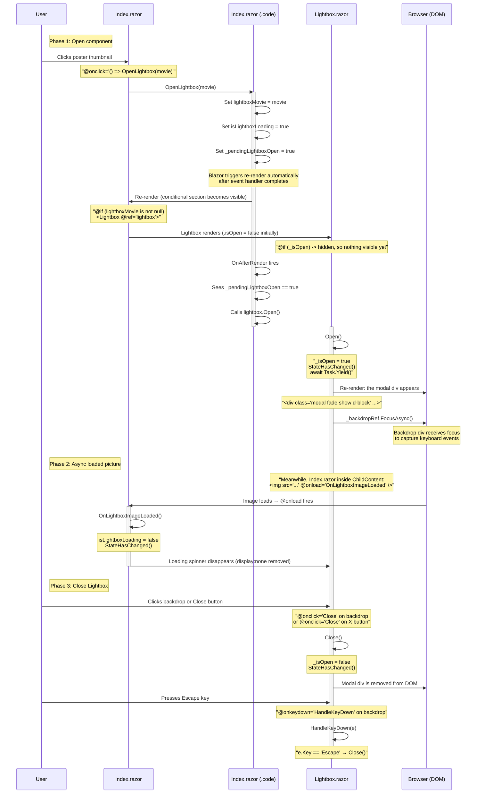

# Lightbox Flow — From Index.razor to Lightbox.razor

This document traces the full lifecycle of the lightbox feature in the Movies Blazor app, from user click to overlay display and dismissal.

---

## Flow Diagram



---

## Code Flow (Step by Step)

### 1. User Clicks a Poster Thumbnail

```razor
@* Index.razor — Poster column in QuickGrid *@
@if (!string.IsNullOrEmpty(movie.PosterUrl))
{
     OpenLightbox(movie)" />
}
```

Thumbnail URL uses `GetPosterThumbUrl()` which resolves TMDB URLs to the smaller `w92` variant for fast loading.

### 2. `OpenLightbox(MovieDto)` — Prepare State

```csharp
private void OpenLightbox(MovieDto movie)
{
    lightboxMovie = movie;          // Stores the movie for the conditional render
    isLightboxLoading = true;       // Shows a spinner while the full-res image loads
    _pendingLightboxOpen = true;    // Flag: tells OnAfterRender to call lightbox.Open()
}
```

Key point: `Lightbox.Open()` cannot be called here because the `@ref="lightbox"` reference isn't set until after the component renders. So the call is deferred to `OnAfterRender`.

### 3. Conditional Rendering — Lightbox Appears in DOM

```razor
@* Index.razor — after the paginated grid *@
@if (lightboxMovie is not null)
{
    <Lightbox @ref="lightbox">
        @if (isLightboxLoading)
        {
            @* Spinner shown while the full-res image loads *@
            <div class="...">
                <div class="spinner-border text-light" ...>
            </div>
        }
        
    </Lightbox>
}
```

- The `<Lightbox>` component is instantiated with `@ref="lightbox"`.
- Its `_isOpen` field is initially `false`, so the modal markup is **not rendered** yet.
- An `img` with the **full-resolution** poster URL (TMDB `w500` via `GetFullPosterUrl()`) is passed as `ChildContent`.
- The image is hidden (`display:none`) until `isLightboxLoading` becomes `false` via `OnLightboxImageLoaded`.

### 4. `OnAfterRender` — Show the Modal

```csharp
protected override void OnAfterRender(bool firstRender)
{
    if (_pendingLightboxOpen)
    {
        _pendingLightboxOpen = false;
        lightbox.Open();   // Calls the Lightbox component's Open() method
    }
}
```

This runs after Blazor has finished rendering the new markup (including the `<Lightbox>`), so the `@ref` is valid.

### 5. `Lightbox.Open()` — Reveal the Overlay

```csharp
public async void Open()
{
    _isOpen = true;
    StateHasChanged();

    await Task.Yield();   // Let the DOM render the modal before focusing
    await _backdropRef.FocusAsync();   // Focus the backdrop for keyboard capture
}
```

- Sets `_isOpen = true` → the Bootstrap modal markup renders.
- Calls `_backdropRef.FocusAsync()` so keyboard events (Escape) are captured on the backdrop div.
- The modal markup is a Bootstrap 5-style overlay:

```razor
<div class="modal fade show d-block" tabindex="0" role="dialog"
     style="background-color: rgba(0,0,0,0.8);"
     @onclick="Close" @onkeydown="HandleKeyDown" @ref="_backdropRef">
    <div class="modal-dialog modal-lg modal-dialog-centered" @onclick:stopPropagation="true">
        <div class="modal-content bg-transparent border-0">
            <div class="modal-header border-0">
                <button type="button" class="btn-close btn-close-white" @onclick="Close" />
            </div>
            <div class="modal-body text-center p-0">
                @ChildContent
            </div>
        </div>
    </div>
</div>
```

Important: `@onclick:stopPropagation="true"` on the inner dialog ensures clicking the image or content area does **not** close the lightbox — only clicking the dark backdrop or the close button triggers `Close()`.

### 6. Image Loads — Spinner Hidden

```csharp
private void OnLightboxImageLoaded()
{
    isLightboxLoading = false;
    StateHasChanged();
}
```

The `@onload` event fires after the full-res image downloads. This removes the spinner and makes the image visible.

### 7. Dismissal — Three Paths

| Action | Handler | Effect |
|---|---|---|
| Click backdrop | `Backdrop @onclick="Close"` | `Close()` called |
| Click ✕ button | `.btn-close @onclick="Close"` | `Close()` called |
| Press Escape | `Backdrop @onkeydown="HandleKeyDown"` | `HandleKeyDown` checks `e.Key == "Escape"` → `Close()` |

```csharp
public void Close()
{
    _isOpen = false;
    StateHasChanged();
}
```

Sets `_isOpen = false`, which removes the entire modal `<div>` from the DOM.

---

## Key Design Decisions

1. **Deferred Open via `_pendingLightboxOpen`** — `Lightbox.Open()` must be called after the component reference is available. `OnAfterRender` is the first safe point.

2. **Two Image Sizes** — Thumbnails use TMDB `w92`, the lightbox uses `w500`. This keeps the grid fast while showing a crisp image in the overlay.

3. **Loading Spinner** — `isLightboxLoading` + `@onload` ensures the user sees a spinner until the full-res image has loaded, avoiding a flash of broken/missing image.

4. **Backdrop Focus for Keyboard** — The outer backdrop div has `tabindex="0"` and is focused after render so that the `Escape` key is captured without requiring the user to tab to it.

5. **Click Propagation Guard** — `@onclick:stopPropagation="true"` on `.modal-dialog` prevents closing when the user clicks the image or content area.

---

## State Variables Summary

| Variable | Type | Purpose |
|---|---|---|
| `lightboxMovie` | `MovieDto?` | When non-null, the Lightbox component renders |
| `isLightboxLoading` | `bool` | Shows/hides the spinner inside the lightbox |
| `_pendingLightboxOpen` | `bool` | Deferred flag: requests `Open()` in `OnAfterRender` |
| `lightbox` | `Lightbox?` | Component reference, set via `@ref` |

(These live in `Index.razor`'s `@code` block.)

| Variable | Type | Purpose |
|---|---|---|
| `_isOpen` | `bool` | Controls visibility of the modal markup |

(This lives in `Lightbox.razor`'s `@code` block.)
